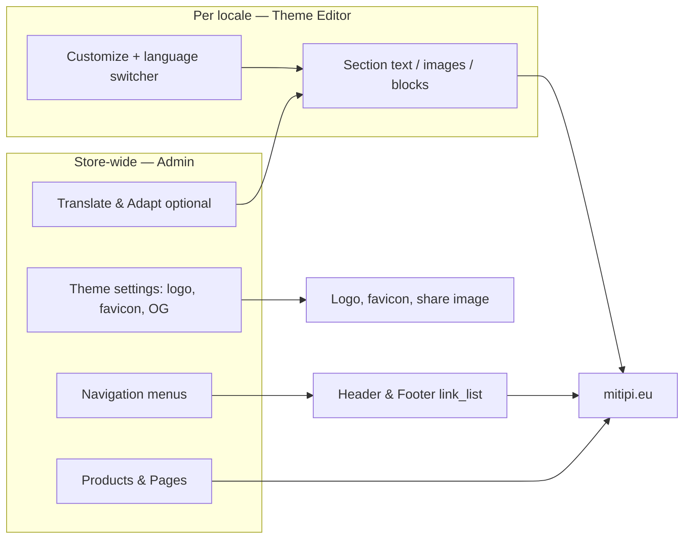

# Editorial CMS plan — per-language copy, footer, menus, media

**Goal:** Content team edits **all customer-facing copy and media** in Shopify Admin / Theme Editor — **per language (EN, NL, FR, DE, CS)** — without Git, code, or developer deploys for text/image changes.

**Store:** mitipi.eu · theme **lurafi-deploy** (`184679596410`)  
**Already live:** Section settings + locale fallbacks, header/footer schemas, homepage blocks. See [CONTENT-TEAM-GUIDE.md](./CONTENT-TEAM-GUIDE.md).

This plan closes the gap between “technically editable” and “easy for the team every day.”

---

## Target experience (what “easy” means)

| Need | Easy path in Shopify |
|------|----------------------|
| Change hero headline in Dutch | Customize → language **Nederlands** → Hero → edit → Save |
| Change footer link label in French | **Navigation** → translate menu **or** edit FR menu copy in Markets |
| Swap homepage product image | Customize → Hero → Product image picker → Save (per locale if needed) |
| Change logo / favicon | Customize → **Theme settings** (gear) → Logo / Favicon |
| Change header nav items | **Online Store → Navigation** → Main menu → assign in Header section |
| Change pricing bullet list | Customize → Pricing → Feature list (pipe-separated) per language |
| Add a spec table row | Customize → Specifications → **Add block** → Spec row |
| Configure page title | Customize → open Configure page → Configure section settings |

**Rule of thumb:** If a field is **blank** in Customize, the site shows the **built-in translation** (from theme locales). Fill the field to **override** that language only.

---

## Architecture (two layers)



| Priority | Wins on storefront |
|----------|-------------------|
| 1 | Non-blank **section setting** for current language |
| 2 | **Navigation menu** link (when assigned) |
| 3 | **Locale** `{{ 'key' \| t }}` fallback |
| 4 | Git seed (`home-en.json`) — dev only |

---

## Phase A — One-time Admin setup (content lead, ~2 hours)

Do this once so Customize is self-explanatory for the team.

### A1. Navigation menus

Create in **Online Store → Navigation**:

| Handle | Purpose | Example links |
|--------|---------|---------------|
| `main-menu` | Header (desktop + mobile) | `#problem`, `#product`, `#how-it-works`, `#app`, `#pricing` |
| `footer-product` | Footer column 1 | Features, How it works, App, Pricing |
| `footer-company` | Footer column 2 | About (mailto), Press, Careers |
| `footer-support` | Footer column 3 | Setup guide, Contact, FAQ |
| `footer-shop` | Footer column 4 | Configure, Cart |

Then in **Customize**:

1. **Header** section → assign **Main menu**.
2. **Footer** section → assign each footer menu + column titles (or leave titles blank for translated defaults).

**Per language:** In **Markets** (or **Translate & Adapt**), translate menu link **titles**. URLs stay the same (`#pricing` works on all locales; use `/nl/pages/...` only for full page links).

### A2. Theme settings (global brand)

**Customize → Theme settings (gear):**

| Setting | Notes |
|---------|--------|
| Logo | KEVIN wordmark; one file for all languages unless you add locale-specific hero images only |
| Favicon | `.png` / `.ico` |
| Default share image | Social OG fallback |
| Products | Kevin + Kevin+ picks |

Logo/favicon are **global** (same for all languages). Editorial images on sections can differ per language.

### A3. Translate & Adapt (recommended for FR/DE/CS bootstrap)

1. Install [Translate & Adapt](https://apps.shopify.com/translate-and-adapt).
2. Enable locales: en, nl, fr, de, cs.
3. Run **auto-translate theme content** once as draft → human review → publish.

Details: [TRANSLATE-AND-ADAPT.md](./TRANSLATE-AND-ADAPT.md).

### A4. Content team cheat sheet

Publish internally (or print):

1. Open [Theme Editor](https://admin.shopify.com/store/6mzhe1-yf/themes/184679596410/editor).
2. Pick **language** top-right **before** editing text.
3. Click section on preview → edit → **Save**.
4. Repeat for each language you changed.
5. Never edit live theme JSON in Git; never ask devs to run `cms:seed` after CMS edits.

---

## Phase B — Daily editorial workflows (by content type)

### B1. Homepage copy (all languages)

| Step | Action |
|------|--------|
| 1 | Customize → select **Nederlands** (example) |
| 2 | Click section (Hero, Problem, Pricing, …) |
| 3 | Edit fields; leave blank any field that should keep the default translation |
| 4 | Save |
| 5 | Preview `https://mitipi.eu/nl/` |

**Sections:** Hero, Problem, Solution, Steps, App, Personas, Stats, Proof, Pricing, Specs, Final CTA — all listed in [CONTENT-TEAM-GUIDE.md](./CONTENT-TEAM-GUIDE.md).

**Pricing features:** One textarea per plan; separate bullets with `|`. Example:  
`Full device ownership|70+ hours of simulations|Free delivery`

### B2. Footer

| What | Where |
|------|--------|
| Disclaimer paragraph | Footer section → Footer note (per locale) |
| Column headings | Footer section → Column titles (per locale) |
| Link lists | **Navigation** menus + Footer section menu pickers |
| Emails | Footer section → support / press / careers emails (usually global) |
| Copyright / legal | Policies in **Settings → Policies**; legal link labels from locales unless overridden later |

### B3. Header & menu

| What | Where |
|------|--------|
| Nav links | **Navigation → main-menu** (translate titles per locale) |
| Buy button text | Header section → CTA labels (per locale) |
| Buy button URL | Header section → CTA URL (usually global → configure) |

If no menu assigned, theme shows default anchor links (still translated via locales).

### B4. Images & icons

| Asset | Editable today | Per locale? |
|-------|----------------|-------------|
| Logo, favicon, OG | Theme settings | Global |
| Hero product shot | Hero → image picker | Yes (switch language in Customize) |
| Solution / Steps / Specs product images | Section image pickers | Yes |
| App carousel (6 phones) | App section → 6 image pickers + alt/captions | Yes |
| Solution pillar icons (☀ ◐ ♪) | **Not in CMS yet** — see Phase D | — |
| Plan checkmarks | SVG snippet — **not editable** | — |
| Cart / menu SVG icons | Code — **not editable** | — |

**Workflow for images:** Customize → language → section → image field → upload or pick from **Content → Files** → Save.

### B5. Secondary pages

| Page | Edit copy | Edit body |
|------|-----------|-----------|
| Configure | Customize on configure page → section settings (title, lede, checkout CTA) | — |
| Blog index | Customize → Blog → eyebrow | **Blog posts** in Admin |
| Legal / LLM / Sitemap | — | **Online Store → Pages** |
| Products | — | **Products** (title, description per locale in Markets) |

### B6. Strings still locale-only (fallback until filled in Customize)

These show translated defaults until section settings are added in later dev work:

- Cart drawer, account login, 404 (most of `locales/*.json`)
- Configure plan cards (partial — header/nav done)
- Header nav labels when menu not assigned
- Footer hardcoded fallbacks when menus not assigned

**Team action:** Use Customize overrides for homepage/header/footer/configure first; request dev only for remaining pages.

---

## Phase C — Make multi-language editing easier (process + optional app)

### C1. Recommended team process

| Task | Who | Tool |
|------|-----|------|
| EN copy change | Content | Customize → English |
| NL copy change | Content | Customize → Nederlands |
| FR/DE/CS bulk first pass | Content + Translate & Adapt | App → review → publish |
| FR/DE/CS fine-tuning | Native speaker | Customize per language |
| New homepage section row | Content | Specs/Proof **blocks** |
| New nav item | Content | Navigation → retranslate |

**Avoid:** Editing `locales/*.json` in Git (developer pipeline). **Prefer:** Theme Editor per locale.

### C2. Optional: translation status spreadsheet

Track per section × locale (EN / NL / FR / DE / CS):

- ☐ Using default translation (blank setting)
- ☑ Customized in Theme Editor
- ⚠ Needs review

Reduces “did we save Dutch pricing?” confusion.

### C3. Optional: Shopify **Content** hub

Use **Content → Files** for shared images (team library). Reference same file across sections or re-upload per locale for localized screenshots.

---

## Phase D — Theme dev backlog (only if team needs more “easy”)

Small, independent PRs — **no design changes**, only more pickers/settings.

| Priority | Item | Benefit |
|----------|------|---------|
| P1 | Schema **info** text on every setting: “Switch language before editing” | Fewer EN-overwrites on NL |
| P1 | **Default** on image pickers → current asset filenames (editor thumbnails) | Easier to find what to replace |
| P2 | Footer: optional **copyright override** setting per locale | Legal line without dev |
| P2 | Configure: settings for plan card titles, step labels, error messages | Full configure CMS |
| P3 | Solution pillars: optional **image_picker** per pillar instead of unicode icons | Marketing-controlled icons |
| P3 | Cart / 404 / account: section settings on those templates | Full site CMS |
| P4 | **Metaobjects** for reusable “callout cards” | Only if blocks become too repetitive |

**Out of scope:** Country selector, layout/CSS changes, metaobjects unless content team hits block limits.

---

## Phase E — QA after editorial changes

### Content team (5 minutes)

- [ ] Changed language in Customize before editing
- [ ] Saved after each language pass
- [ ] Spot-check live URL: `/`, `/nl/`, `/fr/`, `/de/`, `/cs/`
- [ ] Configure + cart still open
- [ ] Mobile: sticky CTA + footer readable

### Developer (on request or monthly)

```bash
npm run theme:check
LURAFI_URL=https://mitipi.eu npm run qa:i18n
```

Do **not** run `npm run cms:seed -- --write` on production without coordinating — it overwrites Git `index.json`, not live Shopify settings, but can confuse the repo.

---

## Rollout checklist

| Step | Owner | Status |
|------|-------|--------|
| Menus created + assigned in Header/Footer | Content lead | ☑ `npm run cms:navigation` |
| Translate & Adapt installed + FR/DE/CS draft | Content lead | ☐ |
| Team trained on language switcher | Content lead | ☐ |
| [CONTENT-TEAM-GUIDE.md](./CONTENT-TEAM-GUIDE.md) shared | Dev | ☑ |
| Kevin+ selling plan on store (subscribe checkout) | Dev | ☑ |
| Schema labels + image hints in theme (Phase D P1) | Dev | ☑ |

---

## Summary

**Today:** mitipi.eu is a **Shopify-hosted storefront** — not a separate “website product.” The theme CMS is live: homepage, header, footer, images, and blocks are editable in **Customize**, **per language**, with locale fallbacks when fields are blank.

**To make it easy for the team:**

1. **One-time:** Create Navigation menus, assign them, install Translate & Adapt, train on the **language dropdown**.
2. **Daily:** Customize → pick language → edit section → Save; use Navigation for menus; Theme settings for logo/favicon.
3. **Optional dev:** More settings on configure/cart/404 and schema hints (Phase D) — only where Customize is still missing fields.

**Editor URL:** https://admin.shopify.com/store/6mzhe1-yf/themes/184679596410/editor
