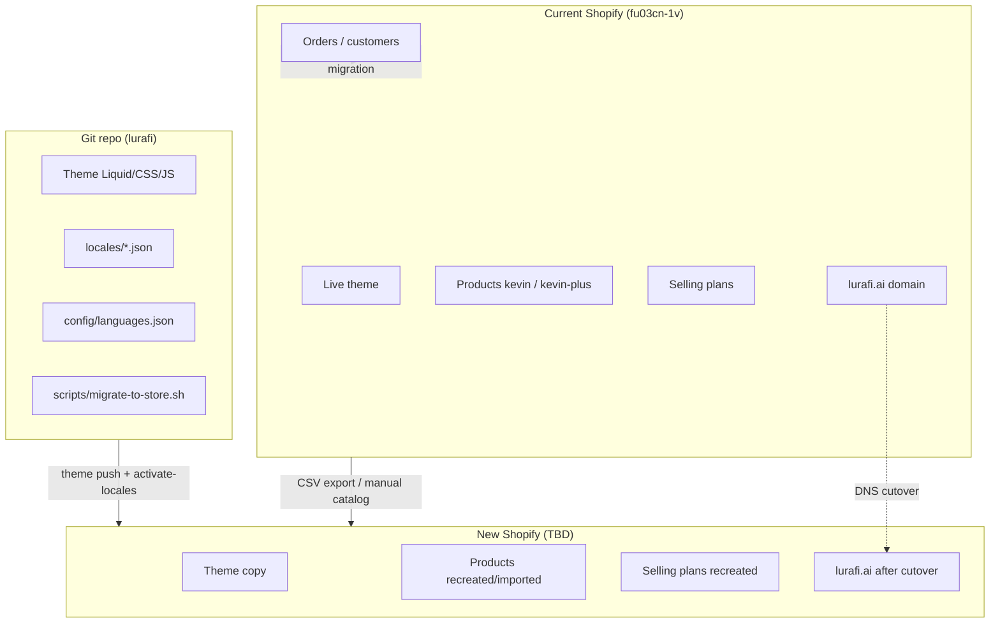

# lurafi.ai — Full Shopify account migration plan

**Version:** 1.0  
**Source store:** `fu03cn-1v.myshopify.com` (live theme `196456219011`)  
**Destination store:** _TBD — `________________.myshopify.com`_  
**Primary domain:** `lurafi.ai`  
**Repo:** [adamripon-ship-it/lurafi](https://github.com/adamripon-ship-it/lurafi)

Operational commands and quick reference: [MIGRATION.md](./MIGRATION.md)  
Automated helper script: `scripts/migrate-to-store.sh`

---

## 1. Executive summary

### Goal

Move the lurafi storefront (Kevin / Kevin+ presence simulator) from the current Shopify account to a **new Shopify account** with equivalent storefront behavior: 12-language site, configure/buy flow, subscription checkout, and `lurafi.ai` as the primary domain.

### Strategy (recommended)

**Phased migration with staging on the new store’s `*.myshopify.com` URL before domain cutover.**

| Phase | Outcome |
|-------|---------|
| 0 — Discovery | Destination store created; access confirmed; inventory documented |
| 1 — Foundation | Billing, markets, legal, payments scaffold on new store |
| 2 — Catalog | Products `kevin` + `kevin-plus` with variants, media, selling plans |
| 3 — Theme & i18n | Theme pushed; locales/pages/translations provisioned via scripts |
| 4 — Store config | Shipping, taxes, checkout, policies, analytics |
| 5 — QA | Functional + i18n + checkout tests on preview URL |
| 6 — Cutover | DNS/domain moved; old store demoted |
| 7 — Post-migration | CI secrets, repo docs, monitoring, decommission plan |

### Estimated timeline

| Mode | Duration | Notes |
|------|----------|-------|
| **Minimum** (experienced operator, catalog already exported) | 2–4 business days | Staging QA + evening/weekend cutover |
| **Typical** (payments KYC, subscription app setup) | 1–2 weeks | Payment provider approval often gates checkout QA |
| **With order/customer history** | +1–3 weeks | Requires Plus transfer or migration app; not in theme scope |

### Out of scope (unless explicitly added)

- Migrating **order history** and **customer accounts** between unrelated Shopify accounts
- Rebuilding **custom apps** not in this repo
- **Email marketing** list migration (Klaviyo etc.) — separate export/import
- **SEO redirect map** beyond Shopify’s built-in domain redirect (consider if URL structure changes)

---

## 2. Architecture — what lives where



### Hard dependencies (theme will break without these)

| Dependency | Handle / ID | Used by |
|------------|-------------|---------|
| Buy product | `kevin` | `sections/main-configure.liquid`, `config/settings_data.json` |
| Subscribe product | `kevin-plus` | Same + `selling_plan_groups` for subscription UI |
| Configure page | `configure` (EN); translated handles per locale | Configure template, CTAs |
| Sitemap page | `sitemap` | Footer, GEO |
| LLM page | `llms` | AI discovery |
| Color variants | grey, white, burgundy/red, espresso/brown, navy/blue | `assets/configure-v2.js`, configure section |
| 12 published locales | en + 11 alternates | `config/languages.json`, language switcher |

Navigation uses **in-theme anchor links** (`#pricing`, `#how-it-works`) — no Shopify menu export required for primary nav, but footer policy links need **Settings → Policies** on the new store.

---

## 3. Roles & access

| Role | Responsibilities |
|------|------------------|
| **Store owner (destination)** | Create store, billing, payment activation, domain ownership, final go/no-go |
| **Developer (theme repo)** | CLI auth, theme push, locale scripts, CI secrets, `geo:generate` |
| **Merchant ops** | Product CSV, pricing, shipping zones, taxes, subscription app |
| **DNS / IT** | Cloudflare DNS for `lurafi.com` (and `lurafi.ai` if used) — see [CLOUDFLARE-DNS.md](./CLOUDFLARE-DNS.md) |

### Access checklist

- [ ] Owner or staff account on **destination** store
- [ ] Shopify CLI authenticated locally (`shopify store auth`)
- [ ] Access to **domain registrar** for `lurafi.ai`
- [ ] Access to **GitHub** repo secrets (if CI deploy used)
- [ ] Document old store **subscription app** name and plan configuration

---

## 4. Phase 0 — Discovery & preparation

**Duration:** 0.5–1 day  
**Gate:** Destination store hostname recorded; migration mode chosen

### 4.1 Document current state (old store)

Export or screenshot from `fu03cn-1v.myshopify.com`:

- [ ] **Products** → Export all (CSV)
- [ ] **Kevin** variant list (option names, SKUs, prices, compare-at, inventory)
- [ ] **Kevin+** selling plan names, billing interval, pricing adjustments
- [ ] **Settings → Markets** — countries, currencies (CHF primary?)
- [ ] **Settings → Shipping and delivery** — zones and rates
- [ ] **Settings → Taxes** — regions and overrides
- [ ] **Settings → Payments** — provider and status
- [ ] **Settings → Policies** — privacy, terms, refund (copy text)
- [ ] **Settings → Checkout** — branding, contact email (`hello@lurafi.ai`)
- [ ] **Apps** — list installed (Subscriptions, analytics, pixels)
- [ ] **Settings → Customer accounts** — legacy vs new customer accounts
- [ ] **Online Store → Themes** — confirm live theme matches repo (`196456219011`)

### 4.2 Create / confirm destination store

- [ ] New Shopify store created (plan appropriate for subscriptions + target markets)
- [ ] Store name and **`shop.name`** acceptable on storefront (header/footer use `shop.name`)
- [ ] Record: `SHOPIFY_STORE=________________.myshopify.com`

### 4.3 Decisions (record before Phase 2)

| Decision | Options | Choice |
|----------|---------|--------|
| Migration mode | Staging first **(recommended)** / direct cutover | |
| Old store after cutover | Pause / keep read-only for orders / close | |
| Customer data | None / export for support only / full migration app | |
| Subscription app | Shopify Subscriptions / other (match old store) | |
| Cutover window | Date/time + timezone (low-traffic) | |

---

## 5. Phase 1 — New store foundation

**Duration:** 0.5–1 day  
**Gate:** Store loads Admin; primary market configured

### 5.1 Store settings

- [ ] **Settings → Store details** — contact email `hello@lurafi.ai`, address, timezone
- [ ] **Settings → Markets** — create/adjust primary market (Switzerland / EU as needed)
- [ ] Set **currency** (CHF if matching current storefront)
- [ ] **Settings → Languages** — leave for Phase 3 script (or enable English only temporarily)

### 5.2 Legal & trust

- [ ] **Settings → Policies** — paste privacy, terms, refund/shipping from old store or legal source
- [ ] Verify footer links render (`sections/footer.liquid` uses `shop.privacy_policy`, `shop.terms_of_service`)

### 5.3 Apps (install before catalog if required)

- [ ] **Shopify Subscriptions** (or equivalent) — required for Kevin+ selling plans
- [ ] Analytics (GA4, Meta pixel, etc.) — note IDs for Phase 4
- [ ] Any app referenced in old checkout/customer flows

### 5.4 Payments (start early — often slow)

- [ ] **Settings → Payments** — begin Shopify Payments or third-party provider setup
- [ ] Complete KYC / business verification (can take 1–5+ days)
- [ ] Enable **test mode** or use Bogus Gateway for QA if production payments not ready

**Exit criteria:** Admin accessible; market + currency set; payment path exists (test or live).

---

## 6. Phase 2 — Catalog & content

**Duration:** 1–2 days  
**Gate:** Both products exist with correct handles; Kevin+ has at least one selling plan

### 6.1 Import or create products

**Option A — CSV import (faster)**

1. Export from old store → Import on new store
2. Verify handles after import:
   - [ ] `kevin`
   - [ ] `kevin-plus`
3. Re-upload **product images** (CSV does not transfer files across accounts)
4. Confirm **inventory** and **pricing** per market

**Option B — Manual create**

Use old store as reference; set SEO handles explicitly.

### 6.2 Variants (configure flow)

Theme expects color-style options. Align option values with configure JS keys where possible:

| Configure key | Theme asset fallback |
|---------------|----------------------|
| grey | `kevin-front-cover-grey-v2.png` |
| white | `kevin-front-cover-white-v2.png` |
| burgundy / red | `kevin-front-cover-red-v2.png` |
| espresso / brown | `kevin-front-cover-brown-v2.png` |
| navy / blue | `kevin-front-cover-blue-v2.png` |

- [ ] At least one variant purchasable on each product
- [ ] Products **published** to Online Store sales channel

### 6.3 Kevin+ subscription

On **new** store (selling plans do not transfer via CSV):

- [ ] Open `kevin-plus` in Admin
- [ ] Create **selling plan** (monthly subscription per old store config)
- [ ] Attach plan to product; verify `selling_plan_groups` visible in storefront preview later

### 6.4 Optional content

- [ ] Collections (if used elsewhere — homepage is section-based, not collection-driven)
- [ ] Blog/articles (if any on old store)
- [ ] Redirects from old URLs (only if handles differ)

**Exit criteria:** Products purchasable in Admin; Kevin+ shows subscription in product editor.

---

## 7. Phase 3 — Theme & internationalization

**Duration:** 0.5–1 day  
**Gate:** Unpublished theme on new store passes Theme Check; 12 locales published

### 7.1 Local setup

```bash
cd /path/to/lurafi
npm ci
export SHOPIFY_STORE="YOUR-NEW-STORE.myshopify.com"
```

### 7.2 Authenticate CLI

```bash
shopify store auth --store "$SHOPIFY_STORE" \
  --scopes read_themes,write_themes,read_locales,write_locales,read_translations,write_translations,\
read_content,write_content,read_online_store_pages,write_online_store_pages,read_markets,write_markets,read_products
```

### 7.3 Run automated migration

```bash
./scripts/migrate-to-store.sh
```

This executes:

1. `npm run locales:build && npm run locales:sync`
2. `npm run theme:check`
3. `shopify theme push --unpublished`
4. `./scripts/activate-locales.sh` — enables 12 locales, market web presences, creates pages, registers product/page translations

### 7.4 Record new theme ID

```bash
shopify theme list -s "$SHOPIFY_STORE"
```

- [ ] Theme ID: `________________`
- [ ] Preview URL tested

### 7.5 Theme editor verification

- [ ] **Online Store → Themes → Customize** — homepage sections render
- [ ] Theme settings: `product_buy` = `kevin`, `product_subscribe` = `kevin-plus`, `configure_page` = `configure` (from `config/settings_data.json`)

### 7.6 Re-run i18n if products were added after first script run

```bash
SHOPIFY_STORE="$SHOPIFY_STORE" ./scripts/activate-locales.sh
```

### 7.7 CDN / GEO assets (after theme ID known)

If theme ID ≠ `1`, update `config/languages.json`:

```json
"discovery": {
  "assetCdnPath": "/cdn/shop/t/{NEW_THEME_ID}/assets"
}
```

Then:

```bash
npm run geo:generate
shopify theme push -s "$SHOPIFY_STORE" --only "assets/llms*.txt" "assets/sitemap-ai.xml"
```

**Exit criteria:** Preview store shows homepage + `/pages/configure`; language switcher lists 12 locales; NL `/nl/pages/kevin-configureren` resolves (or equivalent).

---

## 8. Phase 4 — Store configuration

**Duration:** 1–3 days (parallel with Phase 5 QA)  
**Gate:** Test checkout completes on preview domain

### 8.1 Shipping & taxes

Mirror old store configuration:

- [ ] Shipping zones (CH, EU, ROW as applicable)
- [ ] Rates or carrier-calculated shipping
- [ ] Tax regions and inclusive/exclusive display

### 8.2 Checkout

- [ ] Checkout branding (logo, colors aligned with `assets/lurafi.css`)
- [ ] Contact method and support email
- [ ] Required checkout fields for your markets

### 8.3 Markets & languages (sanity check)

Script configures most of this; verify in Admin:

- [ ] **Settings → Languages** — 12 locales published (en primary)
- [ ] **Markets** — web presence URLs match `config/languages.json` prefixes (`/nl`, `/fr`, …)

### 8.4 Analytics & pixels

- [ ] GA4 / GTM / Meta — install on new store
- [ ] Update any hardcoded store IDs in external tools

### 8.5 Customer accounts

- [ ] Match old store: legacy vs new customer accounts
- [ ] Test login/register if enabled

**Exit criteria:** Add-to-cart → checkout → test payment succeeds (or test gateway).

---

## 9. Phase 5 — Quality assurance

**Duration:** 1–2 days  
**Gate:** Sign-off checklist complete on `*.myshopify.com` preview

### 9.1 Automated

```bash
npm run theme:check
node scripts/i18n-browser-qa.mjs
SMOKE_LOCALES=nl,fr,de,es node scripts/i18n-browser-qa.mjs
```

Set preview base URL if script supports env override (check script or test against published preview link).

### 9.2 Functional smoke tests

| # | Test | Pass |
|---|------|------|
| 1 | EN homepage loads; hero, pricing, CTAs | [ ] |
| 2 | Language switcher → NL; content translated | [ ] |
| 3 | `/pages/configure?plan=buy` — select color, add Kevin | [ ] |
| 4 | Cart → checkout (buy path) | [ ] |
| 5 | `/pages/configure?plan=subscribe` — selling plan shown | [ ] |
| 6 | Cart → checkout (subscription path) | [ ] |
| 7 | `/pages/sitemap` | [ ] |
| 8 | `/pages/llms` or locale equivalent | [ ] |
| 9 | Mobile nav + 48px touch targets (spot check) | [ ] |
| 10 | Footer policy links work | [ ] |

### 9.3 Locale matrix (sample — expand as needed)

| Locale | Prefix | Configure URL | Pass |
|--------|--------|---------------|------|
| en | `/` | `/pages/configure?plan=buy` | [ ] |
| nl | `/nl` | `/nl/pages/kevin-configureren?plan=buy` | [ ] |
| fr | `/fr` | `/fr/pages/configurer-kevin?plan=buy` | [ ] |
| de | `/de` | `/de/pages/kevin-konfigurieren?plan=buy` | [ ] |

Full handle map: `config/languages.json` → each locale’s `pages.configure.handle`.

### 9.4 GEO / AI assets

- [ ] `https://{preview}/cdn/shop/t/.../assets/llms.txt` returns content
- [ ] `sitemap-ai.xml` accessible
- [ ] `robots.txt` / Shopify sitemap present

### 9.5 Sign-off

- [ ] Developer sign-off
- [ ] Merchant/owner sign-off
- [ ] Cutover date scheduled: ________________

---

## 10. Phase 6 — Domain cutover

**Duration:** Cutover window 1–4 hours (+ DNS propagation up to 48h)  
**Gate:** Production domain serves new store; checkout works on live URL

**Domains:** Storefront may use `lurafi.ai`, `lurafi.com`, or both. DNS for **`lurafi.com` on Cloudflare** is documented in [CLOUDFLARE-DNS.md](./CLOUDFLARE-DNS.md).

### 10.0 Cloudflare (`lurafi.com`) — summary

1. **Shopify Admin (new store)** → connect `lurafi.com` and `www.lurafi.com` first.  
2. **Cloudflare → DNS** for `lurafi.com`:

| Type | Name | Content | Proxy |
|------|------|---------|-------|
| A | `@` | Shopify IP from Admin (often `23.227.38.65`) | **Grey cloud (DNS only)** |
| CNAME | `www` | `shops.myshopify.com` | **Grey cloud (DNS only)** |

3. **Do not** use orange cloud (proxied) on these records — Shopify will reject it.  
4. After **Connected**, set primary domain in Shopify.  
5. If canonical URL changes from `lurafi.ai` to `lurafi.com`, update `config/languages.json` and run `npm run geo:generate`.

### 10.1 Pre-cutover (T-24h)

- [ ] Lower DNS TTL at registrar (e.g. 300s) if possible
- [ ] Publish theme on new store:

```bash
shopify theme publish -s "$SHOPIFY_STORE" --theme THEME_ID
```

- [ ] Final smoke test on preview URL
- [ ] Notify stakeholders of maintenance window
- [ ] Old store remains live on current domain until step 10.3 succeeds

### 10.2 Connect domain on new store

**Shopify (both domains if needed):**

1. **Settings → Domains → Connect existing domain**
2. Enter `lurafi.com` (and `lurafi.ai` if still used)
3. Apply DNS records — for Cloudflare details see [CLOUDFLARE-DNS.md](./CLOUDFLARE-DNS.md)

**Cloudflare (`lurafi.com`):**

1. Update `@` A and `www` CNAME per Shopify Admin (grey cloud only)
2. Wait for **Connected** status in Shopify
3. Set **Primary domain** (`lurafi.com` or `www.lurafi.com`)
4. Enable redirect from `*.myshopify.com` to primary

### 10.3 Verification on production domain

- [ ] `https://lurafi.ai/` — EN homepage
- [ ] `https://lurafi.ai/nl/` — Dutch
- [ ] Configure buy + subscribe checkout on live domain
- [ ] SSL certificate valid (Shopify-managed)

### 10.4 Demote old store

**Only after new store verified:**

- [ ] Old store: **Settings → Domains** — remove or stop using `lurafi.ai`
- [ ] Old store: unpublish theme or add staff notice (“store moved”)
- [ ] Keep old Admin access for **order lookup** until retention policy ends

### 10.5 Rollback procedure

If critical failure within cutover window:

1. Revert DNS to old Shopify domain targets (keep old records documented)
2. Re-enable primary domain on **old** store
3. Communicate status; fix new store offline
4. Retry cutover after QA

**Rollback time objective:** &lt; 30 minutes if DNS records pre-documented.

---

## 11. Phase 7 — Post-migration

**Duration:** 1–2 days  
**Gate:** CI deploys to new store; documentation updated

### 11.1 Update repository (production pointers)

Files to update with new store hostname and theme ID:

- [ ] `package.json` — `theme:push:live`
- [ ] `AGENTS.md`
- [ ] `docs/SHOPIFY.md`
- [ ] `docs/GITHUB-CURSOR.md`
- [ ] `.github/workflows/deploy-theme.yml` — default `theme_id`

### 11.2 GitHub Actions secrets

On **new** store: **Settings → Apps → Develop apps** → custom app with `write_themes` → install → copy Admin API access token.

| Secret | Value |
|--------|-------|
| `SHOPIFY_FLAG_STORE` | `new-store.myshopify.com` |
| `SHOPIFY_CLI_THEME_TOKEN` | Theme Access token |

- [ ] Run manual **Deploy theme** workflow once to verify CI

### 11.3 External systems

- [ ] Update Google Search Console property (if domain verification changes)
- [ ] Update Merchant Center / ads linked to store URL
- [ ] Email DNS (SPF/DKIM) if transactional email domain tied to Shopify
- [ ] Status page or internal runbook updated

### 11.4 Old store decommission plan

| Timeline | Action |
|----------|--------|
| +0–30 days | Read-only; support uses for historical orders |
| +30–90 days | Export final order/customer CSV if needed |
| +90 days | Cancel plan or downgrade per business decision |

---

## 12. Risk register

| Risk | Impact | Likelihood | Mitigation |
|------|--------|------------|------------|
| Payment provider not approved before QA | Blocks checkout testing | Medium | Start Phase 1 payments early; use test gateway |
| Wrong product handles | Configure page empty / cart errors | Medium | Verify handles before Phase 3; checklist in Phase 2 |
| Selling plans not recreated | Subscribe flow broken | High | Dedicated Phase 2 step; re-test plan=subscribe |
| DNS propagation delay | Brief downtime or split traffic | Medium | Lower TTL; cutover in low-traffic window |
| Dual domain on two stores | SSL or redirect conflicts | High | Remove domain from old store only after new verified |
| CDN path in llms/sitemap stale | AI/SEO links wrong | Low | Run `geo:generate` after theme ID known |
| Lost order history on new store | Support friction | Expected | Document old Admin access; optional migration app |
| Theme editor settings drift | Wrong product linked | Low | Compare `settings_data.json` after push |

---

## 13. Master checklist (printable)

### Before cutover

- [ ] Phase 0 — Discovery complete
- [ ] Phase 1 — Foundation complete
- [ ] Phase 2 — `kevin` + `kevin-plus` + selling plans live
- [ ] Phase 3 — Theme + 12 locales on new store
- [ ] Phase 4 — Shipping, taxes, payments, policies
- [ ] Phase 5 — QA sign-off on preview URL
- [ ] DNS TTL lowered; rollback records saved
- [ ] Cutover window communicated

### Cutover day

- [ ] Publish theme on new store
- [ ] Connect `lurafi.ai` to new store
- [ ] Production smoke tests pass
- [ ] Remove domain from old store

### After cutover

- [ ] Repo + GitHub secrets updated
- [ ] GEO assets regenerated if needed
- [ ] Monitoring/analytics confirmed
- [ ] Old store decommission schedule set

---

## 14. Command reference (by phase)

| Phase | Command |
|-------|---------|
| 3 | `SHOPIFY_STORE=... ./scripts/migrate-to-store.sh` |
| 3 | `shopify theme list -s $SHOPIFY_STORE` |
| 3 | `SHOPIFY_STORE=... ./scripts/activate-locales.sh` (re-run after products) |
| 3 | `npm run geo:generate` + targeted asset push |
| 5 | `npm run theme:check` |
| 5 | `node scripts/i18n-browser-qa.mjs` |
| 6 | `shopify theme publish -s $SHOPIFY_STORE --theme ID` |
| 7 | Update secrets; `npm run theme:push:live` (after repo update) |

---

## 15. Open items (fill in)

| Item | Owner | Due |
|------|-------|-----|
| Destination store URL | | |
| New live theme ID | | |
| Subscription app + plan config | | |
| Cutover date/time | | |
| Order/customer migration decision | | |
| Payment provider on new store | | |

---

*End of migration plan.*
