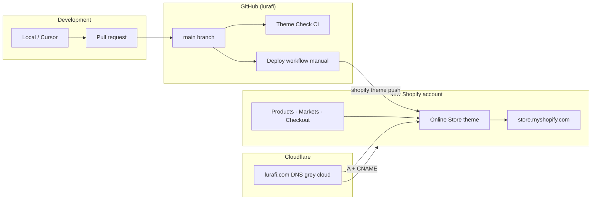
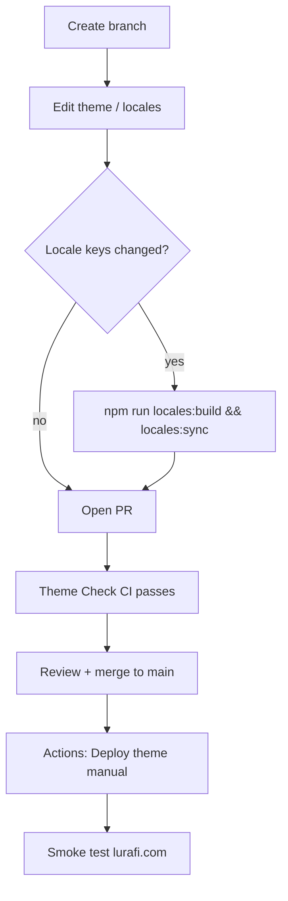

# Best practices: same site on a new Shopify account

**Goal:** Run the lurafi storefront on a **new Shopify account**, served at **`lurafi.com`** (Cloudflare DNS), with **GitHub as the single source of truth** and deploys via **GitHub Actions → Shopify**.

| Item | Value |
|------|--------|
| GitHub repo | `adamripon-ship-it/lurafi` |
| Current production (reference) | `fu03cn-1v.myshopify.com` · theme `196456219011` · `lurafi.ai` |
| Target production | **New** `*.myshopify.com` · **`lurafi.com`** |
| DNS | Cloudflare — [CLOUDFLARE-DNS.md](./CLOUDFLARE-DNS.md) |
| One-shot local bootstrap | `scripts/migrate-to-store.sh` (before CI is wired) |

---

## Principles (follow these throughout)

1. **GitHub `main` is canonical** — never edit the live theme in Shopify Admin except for merchant-only settings (products, payments). Code changes flow: branch → PR → merge → deploy.
2. **Deploy to a duplicate theme first** — use unpublished theme or duplicate in Admin until QA passes; only then publish or `--allow-live`.
3. **Connect domain last** — complete store + theme + checkout QA on `*.myshopify.com` before pointing `lurafi.com` from Cloudflare.
4. **Grey cloud at Cloudflare** — Shopify A/CNAME records must be **DNS only**, not proxied (orange cloud).
5. **One store owns `lurafi.com`** — remove the domain from the old Shopify account after cutover.
6. **Secrets live in GitHub**, not in the repo — Theme Access token + store hostname only in Actions secrets / environments.

---

## Architecture



**What GitHub deploys:** theme files only (`assets/`, `config/`, `layout/`, `locales/`, `sections/`, `snippets/`, `templates/`).  
**What GitHub does not deploy:** products, selling plans, payments, domain — configured in Shopify Admin (and `activate-locales.sh` for Markets/pages/translations).

---

## Phase 0 — Prepare (half day)

### Decisions (record before starting)

| Decision | Recommended choice |
|----------|-------------------|
| Primary URL | `https://lurafi.com` |
| Old store after cutover | Keep read-only for orders 30–90 days |
| Customer/order migration | None (theme-only move) unless you add a migration app |
| Deploy trigger | Manual **Deploy theme** workflow after merge to `main` |
| Canonical domain in repo | Update `config/languages.json` → `"domain": "lurafi.com"` before first production deploy |

### Access checklist

- [ ] **Owner/staff** on the **new** Shopify store
- [ ] **Cloudflare** access to zone `lurafi.com`
- [ ] **GitHub** admin on `adamripon-ship-it/lurafi` (for Actions secrets)
- [ ] Export **products CSV** from old store (reference for Kevin / Kevin+)

### Fill in target values

| Variable | Your value |
|----------|------------|
| `NEW_SHOPIFY_STORE` | `________________.myshopify.com` |
| `NEW_LIVE_THEME_ID` | `________________` (after first push) |
| Cutover date | `________________` |

---

## Phase 1 — Bootstrap the new Shopify store (1–2 days)

Do this in **Shopify Admin** on the new account only.

### 1.1 Store foundation

- [ ] Create store (plan that supports **subscriptions** for Kevin+)
- [ ] **Settings → Store details** — contact `hello@lurafi.ai` (or `@lurafi.com` if you switch email)
- [ ] **Settings → Markets** — primary market, **CHF** if matching current storefront
- [ ] **Settings → Policies** — privacy, terms, refund (copy from old store)

### 1.2 Apps & payments (start early)

- [ ] Install **Shopify Subscriptions** (or same app as old store)
- [ ] **Settings → Payments** — begin provider setup / KYC (often 1–5 days)
- [ ] Use **Bogus Gateway** or test mode for QA if live payments are not ready

### 1.3 Catalog (required for configure/checkout)

Products must use these **handles** (theme hard dependency):

| Handle | Role |
|--------|------|
| `kevin` | One-time purchase |
| `kevin-plus` | Subscription + device |

- [ ] Import CSV from old store **or** create manually
- [ ] Color variants aligned with configure flow (grey, white, burgundy, navy, etc.)
- [ ] Product images uploaded (CSV does not move files across accounts)
- [ ] **Selling plan** on `kevin-plus` recreated on new store
- [ ] Products published to **Online Store** channel

**Exit:** Both products purchasable in Admin; Kevin+ shows a subscription plan.

---

## Phase 2 — Wire GitHub → new Shopify (half day)

### 2.1 Create Theme Access credentials on the **new** store

1. **Settings → Apps and sales channels → Develop apps**
2. Create app (e.g. `GitHub Theme Deploy`)
3. Configure **Admin API** scopes: `read_themes`, `write_themes`
4. Install app on the store
5. Copy **Admin API access token** (shown once) → this is `SHOPIFY_CLI_THEME_TOKEN`

### 2.2 GitHub Actions secrets

Repo → **Settings → Secrets and variables → Actions** → **Environments** → `production` (used by deploy workflow):

| Secret | Value |
|--------|--------|
| `SHOPIFY_CLI_THEME_TOKEN` | Theme Access token from **new** store |
| `SHOPIFY_FLAG_STORE` | `your-new-store.myshopify.com` |

Optional: create a **`staging`** environment with a second token/theme for preview deploys.

- [ ] Secrets updated (do **not** commit tokens)
- [ ] Old secrets for `fu03cn-1v` rotated or removed after cutover

### 2.3 Update repo deploy defaults (after first theme push)

When you know the new live theme ID, update:

- [ ] `.github/workflows/deploy-theme.yml` — default `theme_id`
- [ ] `package.json` — `theme:push:live` script (local emergency deploys)

Commit via PR (Theme Check must pass).

---

## Phase 3 — First deploy from GitHub (half day)

### 3.1 Update canonical domain in repo (recommended before go-live)

```bash
# config/languages.json
"domain": "lurafi.com"
```

Then:

```bash
npm run locales:build && npm run locales:sync
npm run geo:generate
```

Commit on a branch → open PR → merge to `main`.

### 3.2 CI on every PR / push to `main`

Already configured:

- **Theme Check** workflow — `locales:build`, `locales:sync`, `shopify theme check`

- [ ] Open PR with domain/config changes; confirm **Theme Check** green

### 3.3 Initial theme push (choose one path)

**Path A — GitHub (preferred after secrets exist)**

1. Merge to `main`
2. **Actions → Deploy theme (manual) → Run workflow**
3. Enter **new** `theme_id` (or use updated default)
4. First run: create theme by pushing to unpublished from local if no theme exists yet:

```bash
export SHOPIFY_STORE="your-new-store.myshopify.com"
shopify store auth --store "$SHOPIFY_STORE" --scopes read_themes,write_themes
shopify theme push -s "$SHOPIFY_STORE" --unpublished
shopify theme list -s "$SHOPIFY_STORE"   # note theme ID
```

Then use that ID in the GitHub deploy workflow.

**Path B — Local bootstrap (then switch to GitHub)**

```bash
export SHOPIFY_STORE="your-new-store.myshopify.com"
./scripts/migrate-to-store.sh
```

Re-run GitHub deploy for all future updates.

### 3.4 Admin i18n (not in theme zip)

After products exist:

```bash
SHOPIFY_STORE="your-new-store.myshopify.com" ./scripts/activate-locales.sh
```

This enables 12 locales, market URLs, utility pages, and product/page translations.

- [ ] Theme visible on `https://your-new-store.myshopify.com`
- [ ] `/pages/configure?plan=buy` works
- [ ] Language switcher shows 12 locales

**Do not connect `lurafi.com` yet.**

---

## Phase 4 — Cloudflare → new Shopify (`lurafi.com`)

Full detail: [CLOUDFLARE-DNS.md](./CLOUDFLARE-DNS.md)

### 4.1 Connect domain in **new** Shopify Admin

1. **Settings → Domains → Connect existing domain**
2. Enter `lurafi.com` (and `www.lurafi.com`)
3. Copy the **exact** A record IP and CNAME target Shopify shows

### 4.2 Cloudflare DNS records

**Cloudflare → lurafi.com → DNS → Records**

| Type | Name | Content | Proxy |
|------|------|---------|-------|
| A | `@` | Shopify IP from Admin | **Grey (DNS only)** |
| CNAME | `www` | `shops.myshopify.com` | **Grey (DNS only)** |

- [ ] No orange cloud on Shopify records
- [ ] Conflicting A/CNAME removed
- [ ] TTL lowered to 300 before cutover (optional)

### 4.3 Primary domain & SSL

- [ ] Shopify shows **Connected** for `lurafi.com`
- [ ] **Primary domain** = `lurafi.com` (or `www.lurafi.com` — pick one)
- [ ] Redirect `*.myshopify.com` → primary enabled
- [ ] HTTPS valid on apex and www

### 4.4 Detach from old store

Only after new site verified:

- [ ] **Old** store → **Settings → Domains** → remove `lurafi.com` / `www`

---

## Phase 5 — QA sign-off (1–2 days)

### Automated

```bash
LURAFI_URL="https://your-new-store.myshopify.com" node scripts/i18n-browser-qa.mjs
# After domain live:
LURAFI_URL="https://lurafi.com" node scripts/i18n-browser-qa.mjs
```

### Manual matrix

| Test | Staging URL | lurafi.com |
|------|-------------|------------|
| EN homepage | [ ] | [ ] |
| `/nl/` locale | [ ] | [ ] |
| Configure buy | [ ] | [ ] |
| Configure subscribe | [ ] | [ ] |
| Cart → checkout | [ ] | [ ] |
| Footer policies | [ ] | [ ] |
| `llms.txt` / sitemap assets | [ ] | [ ] |

### Post-domain GEO push

If theme CDN path changed:

```bash
npm run geo:generate
# Deploy assets via GitHub workflow or:
shopify theme push -s "$SHOPIFY_STORE" --only "assets/llms*.txt" "assets/sitemap-ai.xml"
```

- [ ] Merchant sign-off
- [ ] Developer sign-off

---

## Phase 6 — Ongoing workflow (GitHub → Shopify)

This is the **standard operating procedure** after migration.



### Developer checklist per change

1. Branch from `main`
2. If translation keys changed: `npm run locales:build && npm run locales:sync`
3. `npm run theme:check` locally
4. Open PR → wait for **Theme Check**
5. Merge to `main`
6. Run **Deploy theme (manual)** with live `theme_id`
7. Spot-check `https://lurafi.com/` and one locale (e.g. `/nl/`)

### When to run Admin scripts (not GitHub)

| Change | Action |
|--------|--------|
| New locale in `languages.json` | `./scripts/activate-locales.sh` on store |
| New translated product copy in config | Re-run `activate-locales.sh` |
| Products/pricing/shipping | Shopify Admin only |
| Domain/DNS | Cloudflare + Shopify Domains |

### What never goes in git

- Theme Access tokens, `.env`, `.shopify/` session cache
- `node_modules/`

---

## Recommended CI improvements (optional)

Current deploy workflow pushes theme files only. Best practice additions:

1. **Pre-push locale build in deploy job** (match Theme Check):

```yaml
- run: npm run locales:build && npm run locales:sync
- run: shopify theme push --theme "${{ inputs.theme_id }}" --allow-live
```

2. **Separate staging workflow** — push to unpublished theme on every merge to `main`; manual promote to live.

3. **GitHub Environment protection** — require reviewer approval before production deploy.

4. **Dependabot** — already enabled; keep `@shopify/cli` current.

---

## Rollback

| Layer | Rollback |
|-------|----------|
| Theme code | Re-run deploy workflow with previous git tag/commit checkout, or `git revert` + deploy |
| Domain | Cloudflare: restore saved A/CNAME; old store reconnects domain |
| Full store | Keep old Shopify account until migration signed off |

Save before cutover:

```
lurafi.com @ A → _______________
www CNAME → _______________
Previous Shopify store → _______________
```

---

## Master checklist

### Before pointing lurafi.com

- [ ] New store: products `kevin` + `kevin-plus` + selling plan
- [ ] GitHub secrets point to **new** store
- [ ] Theme deployed from GitHub (or migrate script)
- [ ] `activate-locales.sh` run; 12 locales live
- [ ] Checkout tested on `*.myshopify.com`
- [ ] `config/languages.json` domain = `lurafi.com` (if using .com in assets)

### Cutover

- [ ] Connect `lurafi.com` on **new** store
- [ ] Cloudflare grey-cloud A + CNAME
- [ ] Primary domain + SSL green
- [ ] Production smoke tests on `https://lurafi.com`
- [ ] Remove domain from **old** store

### After cutover

- [ ] Update `AGENTS.md`, `docs/SHOPIFY.md`, deploy workflow default theme ID
- [ ] Team uses **Deploy theme** workflow for all theme releases
- [ ] Old store decommission schedule documented

---

## Related docs

| Doc | Purpose |
|-----|---------|
| [CLOUDFLARE-DNS.md](./CLOUDFLARE-DNS.md) | Cloudflare records for `lurafi.com` |
| [MIGRATION.md](./MIGRATION.md) | Command quick reference |
| [MIGRATION-PLAN.md](./MIGRATION-PLAN.md) | Detailed phase/risk register (legacy `.ai` references) |
| [GITHUB-CURSOR.md](./GITHUB-CURSOR.md) | GitHub auth + secrets |
| [SHOPIFY.md](./SHOPIFY.md) | Day-to-day Shopify ops |
| [I18N.md](./I18N.md) | 12-locale system |

---

*This document is the canonical best-practices plan for new-account + lurafi.com + GitHub deploy.*
